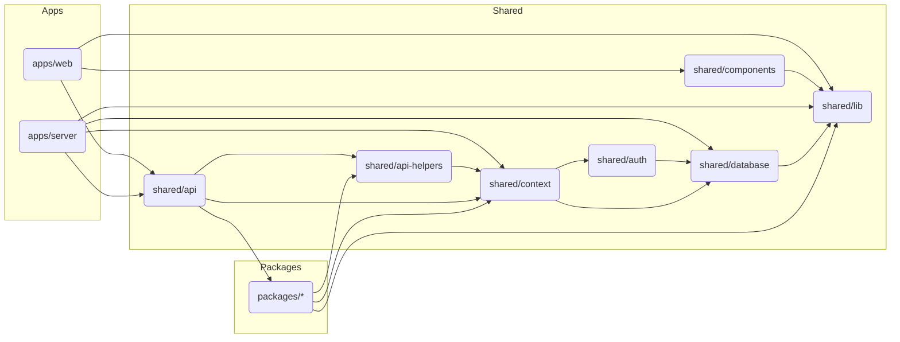

# MAHAUS - Strategic Creative Agency

MAHAUS is a strategic creative agency that acts as a catalyst for ambitious, aspirational brands. We combine disruptive creativity, agile execution, and real-world professional experience to transform brand potential into measurable revenue and sustainable global impact.

## About MAHAUS

### Mission
To be the strategic catalyst for ambitious, aspirational brands, translating their potential into measurable revenue and sustainable global impact. We achieve this by blending disruptive creativity and agile execution with real professional experience, forging genuine, engaged communities for enduring growth.

### Vision
To become the globally recognized growth partner that defines the next generation of brand development, known for pioneering high-impact strategies that consistently elevate brands from local intention to global influence, all while setting the standard for quality and competitive value.

### Core Values

| Value | Description |
|-------|-------------|
| **Catalytic Agility** | We move with speed and precision, acting as the dynamic force that turns ideas into outcomes quickly and effectively. |
| **Real-World Experience** | Our strategies are grounded in proven, professional insights that transform complex challenges into clear, actionable growth paths. |
| **Disruptive Creativity** | We challenge the status quo, delivering innovative ideas and content that cut through the noise. |
| **Quality Over Cost** | We believe true value exceeds the price tag. We deliver the highest standard of strategy and execution. |
| **Community Focus** | We guide brands not just to acquire customers, but to cultivate genuine, lasting communities. |

### Brand Promise
> "We promise to be your nimble, expert partner, transforming your brand's potential into tangible revenue and a powerful, enduring community."

---

## Services

### I. Growth & Conversion
Services designed to drive traffic, engagement, conversion, and retention.

- **Growth & Automations**: Email, SMS, WhatsApp marketing and sales automation
- **Strategic Digital Advertising**: Meta (Facebook/Instagram), Google Ads, TikTok
- **Strategy, Content & Social Management**: Digital strategy, content planning, social media management, analytics

### II. Digital Infrastructure & Products
Platforms and tools needed to operate, sell, and scale.

- **Digital Product Development**: Websites, Landing Pages, E-commerce, Mobile Apps
- **Domain Administration & Technical Measurement**: Analytics implementation and monitoring

### III. Brand Identity & Content
Ensuring coherent, attractive, and professional communication.

- **Brand Creation**: Logo, Brand Book, Typography, Color Palette
- **Content Creation**: Video, Photography, Graphic Design, Blogs

---

## Brand Guidelines

### Color Palette

| Color | HEX | RGB | Usage |
|-------|-----|-----|-------|
| Blue | `#3170b7` | 49, 112, 183 | Accent color |
| Yellow | `#eba42b` | 235, 164, 43 | Primary accent |
| Red | `#e54129` | 229, 65, 41 | Call to action, highlights |
| Cream | `#e9d5b6` | 233, 213, 182 | Light backgrounds |
| Dark Navy | `#151921` | 21, 25, 33 | Primary dark, text |
| Gray | `#d1d1d1` | 209, 209, 209 | Neutral, borders |

### Typography

| Type | Font | Usage |
|------|------|-------|
| Primary - Titles | **Anybody Bold** | Headlines, main titles |
| Primary - Subtitles | **Anybody Regular** | Subtitles, secondary headings |
| Secondary - Body | **Geomanist Regular** | Body text, paragraphs |
| Decorative | **Bauhaus** | Special accents, decorative elements |

---

## Tech Stack

- **Runtime**: Node.js v22.x
- **Package Manager**: pnpm with workspaces
- **Web**: React 19, Vite, TailwindCSS 4, React Router 7
- **Backend**: Hono, tRPC 11
- **Database**: PostgreSQL with Drizzle ORM
- **Auth**: Better Auth
- **Linting/Formatting**: Biome

## Project Structure

```
mahaus/
├── apps/
│   ├── web/          # React frontend (Vite)
│   └── server/       # Node.js backend (Hono + tRPC)
├── shared/           # Cross-cutting shared code
│   ├── api/          # tRPC router composition
│   ├── api-helpers/  # Base tRPC procedures and middleware
│   ├── auth/         # Authentication logic
│   ├── components/   # Shared React components
│   ├── context/      # Dependency injection context
│   ├── database/     # Drizzle schema and connection
│   └── lib/          # Utility functions
├── packages/         # Business logic features
└── docs/             # Documentation
```

## Development

### Quick Start

```bash
# Install dependencies
pnpm install

# Start development server
pnpm dev

# Database operations
pnpm db:push          # Push schema changes

# Code quality
pnpm format           # Format code with Biome
pnpm lint             # Type-check with TypeScript
pnpm test             # Run tests
```

### Architecture Principles

1. **No Global State** - All dependencies passed through Context
2. **Unidirectional Dependencies** - apps -> packages -> shared (no circular deps)
3. **Type-Safe APIs** - tRPC for end-to-end type safety
4. **Modular Design** - Features encapsulated in packages

---

## Dependencies Diagram



---

## License

Private - MAHAUS 2024
